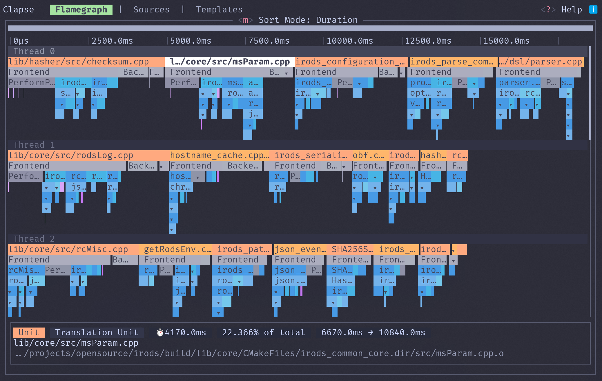
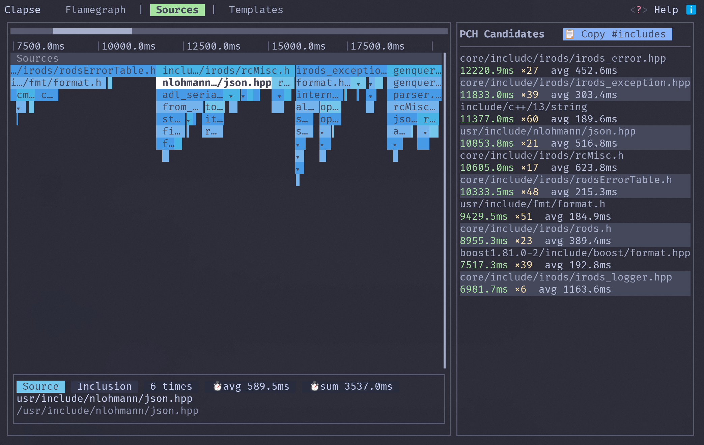
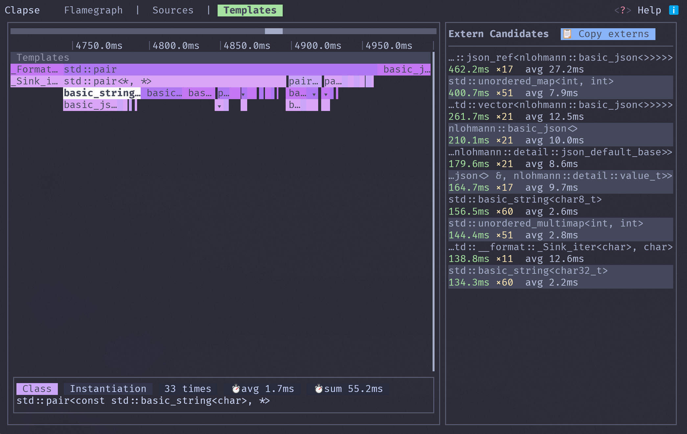

# Clapse

[](https://github.com/mkellal/clapse/actions/workflows/build.yml)
[](LICENSE)
[](https://blog.rust-lang.org/2024/10/17/Rust-1.82.0.html)

Terminal-based C++ build profiling tool. Parses Clang `-ftime-trace` JSON output into an interactive flamegraph TUI for identifying compilation bottlenecks.

<p align="center">
  
  
  
</p>

## Table of Contents

- [Features](#features)
- [Quick Start](#quick-start)
- [Installation](#installation)
- [Usage](#usage)
- [Keybindings](#keybindings)
- [Architecture](#architecture)
- [Contributing](#contributing)
- [License](#license)

## Features

- **Flamegraph tab** — hierarchical time-aligned tracks of all compilation spans. Zoom/pan, click spans for details.
- **Sources tab** — spans aggregated by source file. Identifies top PCH candidates ranked by cumulative parse time (copiable as code).
- **Templates tab** — spans aggregated by template instantiation. Lists top slowest concrete instantiations as `extern template` candidates (copiable as code).
- **Search** — full-text search across all spans. `Enter` to seek, `n`/`p` to jump through matches.
- **Keyboard + mouse** — arrow keys, scroll wheel, click-to-select. `?` shows contextual keybindings.

## Quick Start

Enable `-ftime-trace` in your CMake build with Ninja (recommended for accurate per-translation-unit timing):

```sh
cmake -GNinja -DCMAKE_CXX_FLAGS="-ftime-trace" ..
ninja
```

Then point Clapse at your build directory:

```sh
clapse build/
```

> **Note:** Ninja is recommended but optional. Without a `.ninja_log`, Clapse still works — translation unit start times default to `beginningOfTime` instead of actual wall-clock time, but per-file flamegraphs remain accurate.

## Installation

### Prerequisites

- Rust toolchain 1.82 or later ([rustup](https://rustup.rs))

### From source

```sh
git clone https://github.com/mkellal/clapse.git
cd clapse
cargo install --path .
```

Or download from [GitHub Releases](https://github.com/mkellal/clapse/releases).

## Usage

```sh
# Open the TUI on a build directory
clapse <build-dir>
```

Clapse automatically discovers `-ftime-trace` JSON files (matching `*.*.json`) that have a corresponding `.o` file in the build tree.

## Keybindings

| Key | Action |
|-----|--------|
| `q` / `Ctrl+C` | Quit |
| `?` | Toggle help popup |
| `s` | Open search |
| `Alt+1/2/3` | Jump to tab |
| `Alt+t` | Rotate to next tab |
| `↑` / `↓` | Navigate to parent / child span |
| `←` / `→` | Navigate to previous / next sibling |
| `Ctrl+↑` / `Ctrl+↓` | Zoom in / out |
| `+` / `-` | Zoom in / out (alternate) |
| `Ctrl+←` / `Ctrl+→` | Pan left / right |
| `PageUp` / `PageDown` | Zoom in / out fast (×2) |
| `Space` | Zoom to selected span |
| `r` | Reset zoom & pan |
| `Tab` / `Shift+Tab` | Next / previous track |
| `m` | Toggle sort mode (flamegraph tab) |
| `Ctrl+Y` | Copy candidates to clipboard (sources/templates) |
| `Esc` | Deselect span / close search |
| Click | Select span, show details |
| Scroll wheel | Vertical scroll |

## Architecture

```
src/
├── main.rs          # Entry point, terminal setup
├── cli.rs           # CLI argument parsing (clap)
├── traces/
│   ├── event.rs     # -ftime-trace JSON deserialization (serde)
│   └── file.rs      # Glob-based trace file discovery
├── app/
│   ├── mod.rs       # App state, event loop, tab routing
│   ├── span.rs      # Span IR (type, timing, hierarchy)
│   ├── view.rs      # Track scheduling, ordering, span→screen mapping
│   ├── search.rs    # Full-text search state
│   ├── help.rs      # Help popup widget
│   └── tabs/
│       ├── flamegraph.rs  # Raw hierarchical flamegraph
│       ├── sources.rs     # Source-file aggregates + PCH candidates
│       └── templates.rs   # Template aggregates + extern candidates
└── widgets/
    ├── flamegraph.rs      # Flamegraph renderer (Unicode block chars)
    ├── track.rs           # Single-track rendering
    ├── span.rs            # Individual span cell rendering
    ├── span_details.rs    # Span detail panel
    ├── pch_candidates.rs  # Candidate list with copy-to-clipboard
    ├── time_range.rs      # Time-axis ruler
    ├── color.rs           # Catppuccin palette + depth-based shading
    └── start_screen.rs    # Loading / empty-state screen
```

## Contributing

Bug reports and pull requests welcome on [GitHub](https://github.com/mkellal/clapse).

Before submitting a PR, ensure:

```sh
cargo fmt --all -- --check
cargo clippy -- -D warnings
cargo test
```

## License

MIT © [Mouaadh KELLAL](https://github.com/mkellal)
